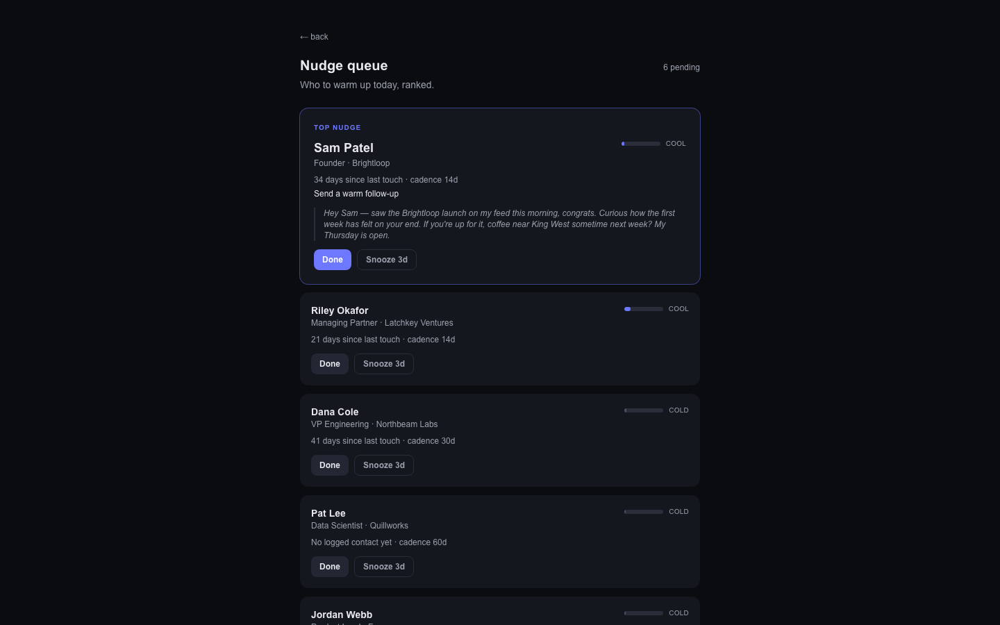
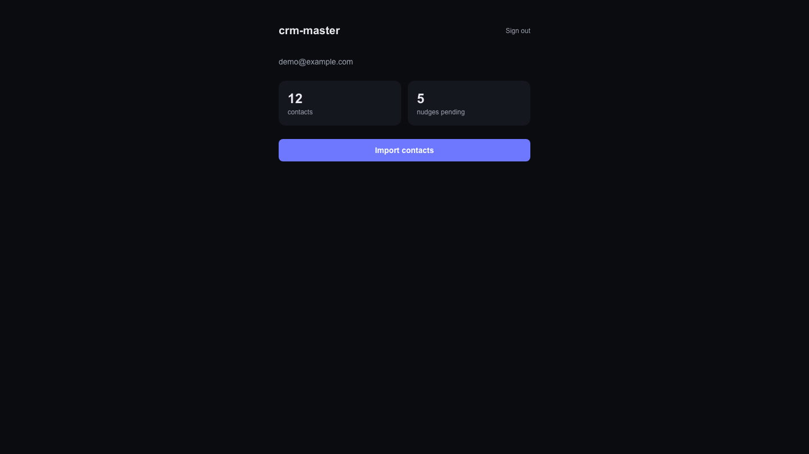
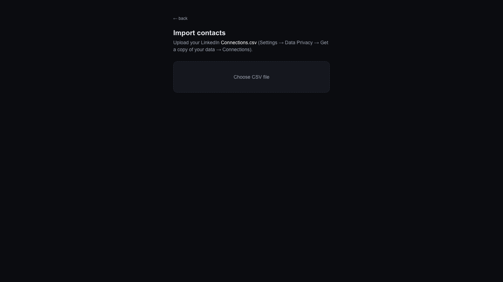

# crm-master

[](https://github.com/dylanpulver/crm-master/actions/workflows/ci.yml)

**A behavioral relationship engine — a personal CRM that does the discipline for you.**

Most CRMs are databases you stop opening. The system is never the bottleneck — *you* are.
crm-master flips the model: instead of documenting a discipline, it drives one. Everything
collapses into a single daily surface — a nudge queue that tells you who to warm up, why,
and gives you a one-tap way to do it.

> A pretty CRM nobody opens is worth zero. An ugly nudge engine used daily is worth everything.

## Screenshots

*Seeded demo data — all names and contacts are fictional.*

**Nudge queue** — the daily surface: who to warm up today, ranked. Each row shows
why-now, live warmth, the AI draft when one exists, and one-tap done / snooze.



**Dashboard** — your network at a glance: contact count and the pending nudge queue
(the stat card links straight into the queue).



**Import** — LinkedIn `Connections.csv` in, normalized and deduped contact graph out.



## How it works

1. **Import your network** — LinkedIn CSV import with aggressive normalization and dedup
   (canonical emails, E.164 phones, merge tombstones).
2. **Warmth decays automatically** — every contact carries a warmth score that decays over
   time and recovers with real interactions.
3. **The nudge queue does the thinking** — "you haven't warmed X in 3 weeks" surfaces as a
   concrete, ready-to-send action, not a to-do.
4. **Drafts, not automation you can't trust** — AI-drafted outreach defaults to
   draft-for-review. Every `(draft → edited → sent)` diff is captured, so drafts converge on
   how you actually write.
5. **One-tap actions** — HMAC-signed, single-use action links that work in any mail client.

## Design principles

- **Behavioral-first, not database-first.** Every feature must be a *fixture* — a scaffold
  that mechanically forces the right action — or it doesn't get built.
- **Relational capital accounting.** Your network is an asset class you invest in *before*
  you need it. The tool tracks where capital is thin and what to invest in now.
- **Privacy-minimal by design.** Email sync uses metadata only (headers and dates, never
  bodies); raw data folds into per-contact aggregates and is discarded.

## Stack

Next.js (App Router) · TypeScript · Supabase (Postgres + RLS, pg_cron) · Vercel ·
magic-link auth · AES-encrypted OAuth tokens

## Status

Active development, personal-use scope (single-user by design). Current surface: auth,
LinkedIn import, contact graph + normalization pipeline, warmth scoring, AI draft
generation, nightly digest job, and the nudge queue page (`/nudges`) — the ranked daily
surface with one-tap done / snooze.

## Running it

```bash
cp .env.local.example .env.local   # see docs/PREREQS.md for each value
npm install
npm run dev
```

## License

MIT
